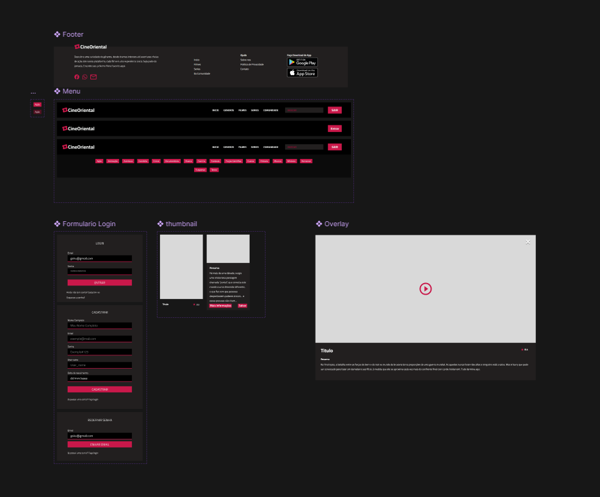
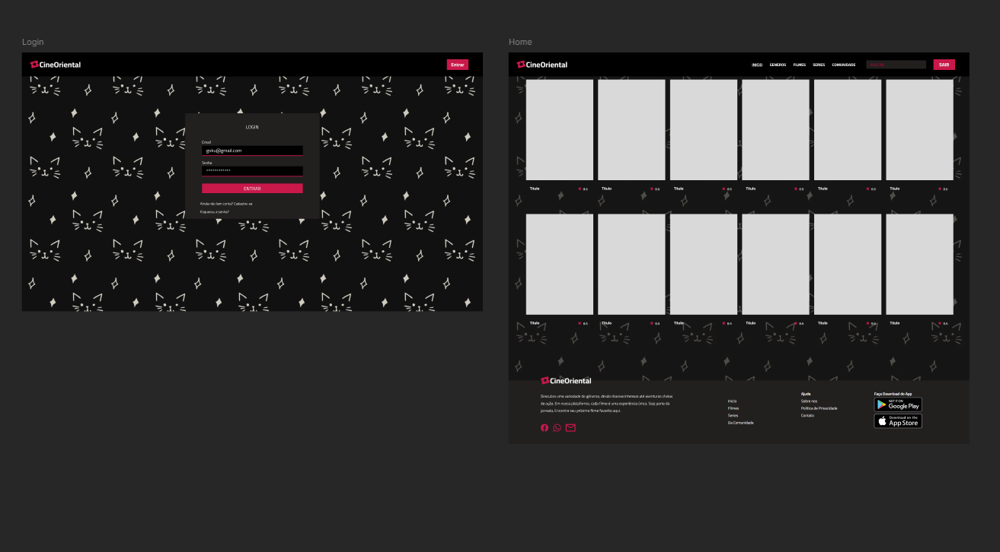
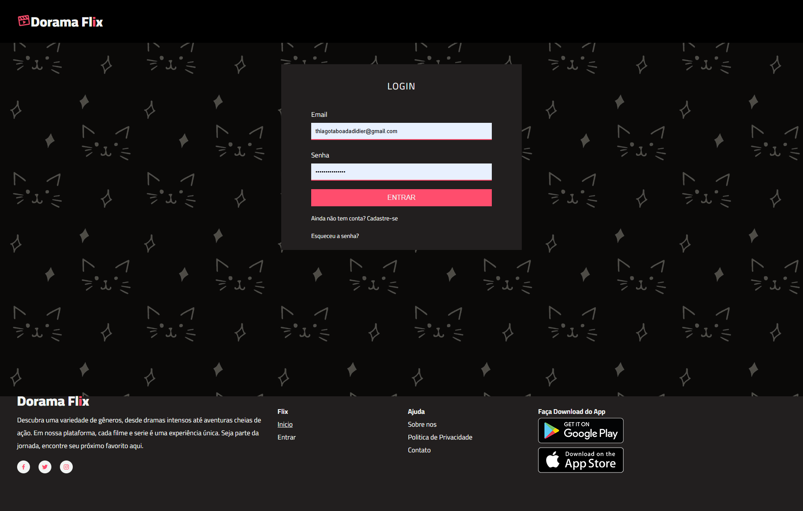
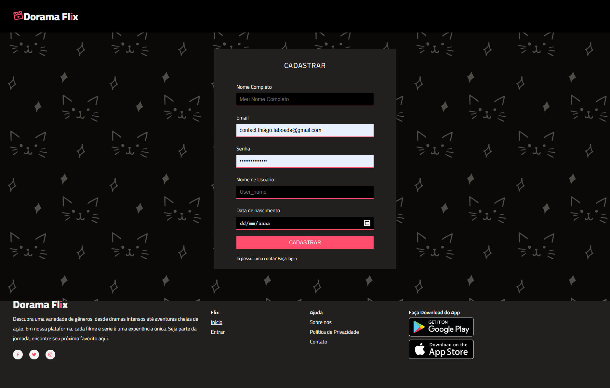
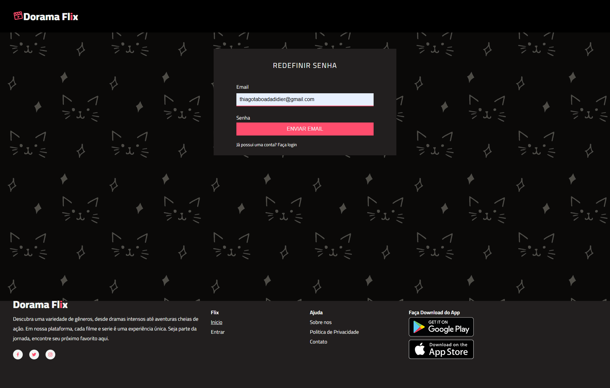
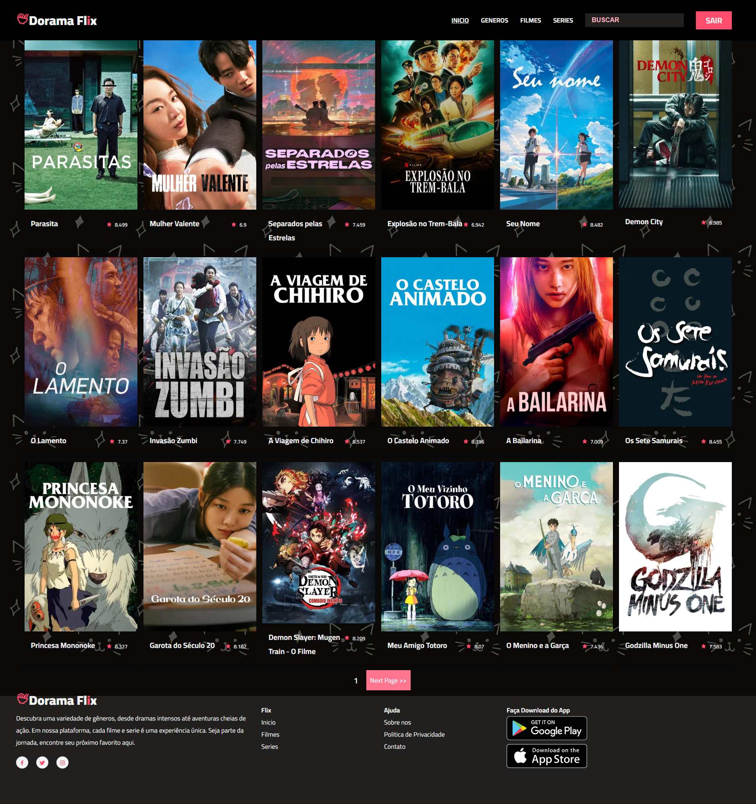
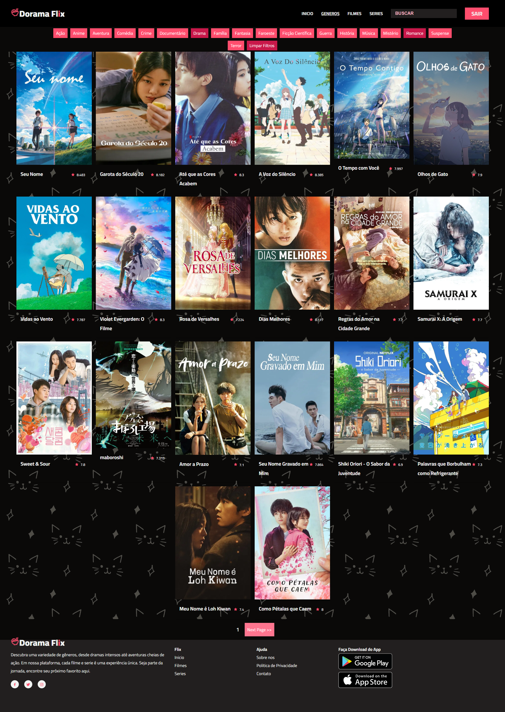
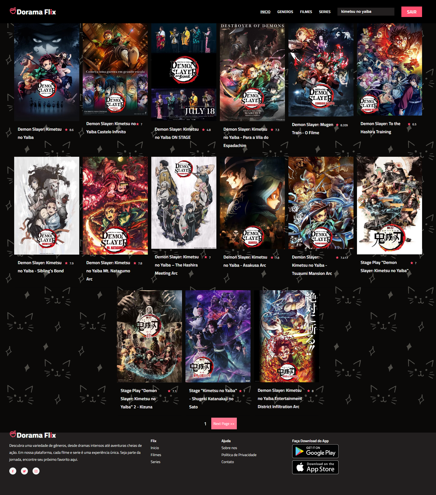
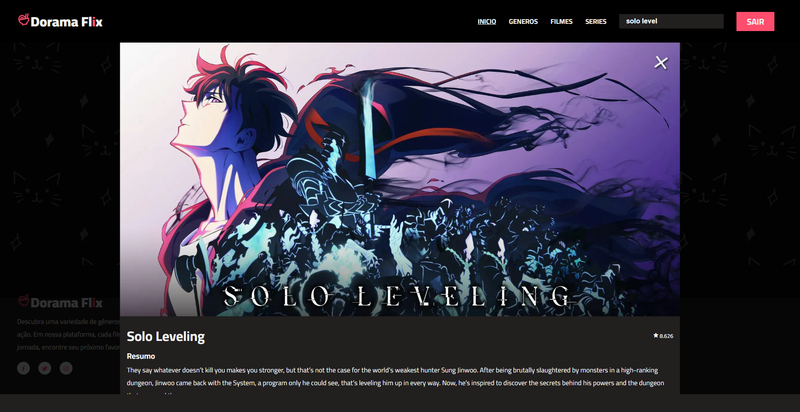

# 🎬 Dorama Flix

Dorama Flix é uma plataforma web interativa para fãs de doramas, animes, filmes e séries orientais. Com uma interface moderna e intuitiva, o site permite que os usuários explorem, pesquisem e assistam a conteúdos asiáticos — diretamente de uma base de dados dinâmica conectada à TMDB API. O sistema também oferece um gerenciamento de usuários com login e autenticação via Firebase.

---

## 📌 Descrição do Projeto

O objetivo do Dorama Flix é oferecer uma experiência simples e agradável para amantes de produções orientais. Os usuários podem:

* Criar uma conta e fazer login de forma segura.
* Navegar por uma vasta lista de doramas, animes, filmes e séries.
* Visualizar detalhes como sinopse, avaliação e trailer.
* Pesquisar por títulos específicos.
* Favoritar conteúdos para assistir depois (função opcional se implementada).

---

## 🛠️ Tecnologias Utilizadas

O projeto foi desenvolvido com as seguintes tecnologias:

* **HTML5** – estrutura e semântica da página
* **CSS3** – estilos e responsividade
* **JavaScript (ES6)** – lógica e manipulação dinâmica da interface
* **TMDB API** – fornecimento de dados sobre filmes e séries orientais
* **Firebase Authentication** – gerenciamento de usuários (login e cadastro)

---

## 🚀 Visual do Projeto

### 💻 Site em Funcionamento
[Dorama Flix](https://thiago-taboada.github.io/dorama-flix/) - *Deploy do projeto no Github Pages*

### 🎨 Protótipo no Figma

[Figma Design Dev Mode](https://www.figma.com/design/FVH2iT1k7o430xRvLprSzI/CineOriental?node-id=2-5&m=dev&t=fmoAnnQN4Qkxo1oy-1) - *Interface desenhada no Figma*

[Figma Design Prototipo](https://www.figma.com/proto/FVH2iT1k7o430xRvLprSzI/CineOriental?node-id=2-5&t=fmoAnnQN4Qkxo1oy-1) - *Interface desenhada no Figma*

#### 📷 Prints do Protótipo

*Components*

*Telas*

### 📷 Prints do Site publicado

*Tela de login*

*Tela de Cadastro*

*Redefinir senha*

*Tela inicial*

*Tela Series*

*Filtro por Generos*

*Pesquisa por Titulo*

*Mais informação e videoplayer*
---

## 👨‍💻 Autores

* **\[Thiago Andres Taboada Didier de Freitas]** –
  [GitHub](https://github.com/Thiago-Taboada)

* **\[Isabelle da Silva Oliveira]** –
  [GitHub](https://github.com/)

* **\[Bruno Sotero Lima]** –
  [GitHub](https://github.com/)

